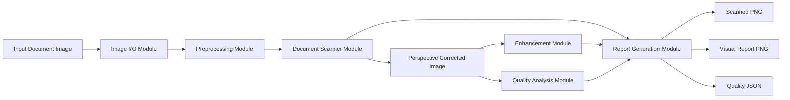

# System Architecture Diagram

```mermaid
flowchart LR
    A[Input Document Image] --> B[Image I/O Module]
    B --> C[Preprocessing Module]
    C --> D[Document Scanner Module]
    D --> E[Perspective Corrected Image]
    E --> F[Enhancement Module]
    E --> G[Quality Analysis Module]
    D --> H[Report Generation Module]
    F --> H
    G --> H
    H --> I[Scanned PNG]
    H --> J[Visual Report PNG]
    H --> K[Quality JSON]
```

