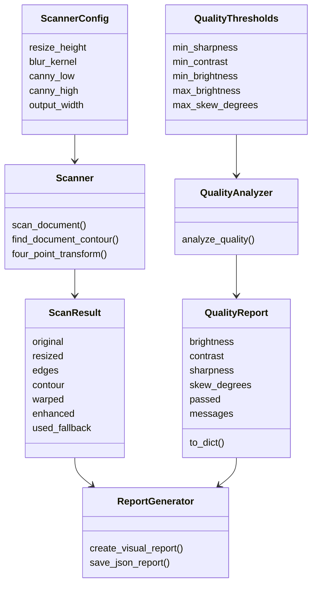

# Class / Component Diagram

```mermaid
classDiagram
    class ScannerConfig {
        resize_height
        blur_kernel
        canny_low
        canny_high
        output_width
    }

    class QualityThresholds {
        min_sharpness
        min_contrast
        min_brightness
        max_brightness
        max_skew_degrees
    }

    class ScanResult {
        original
        resized
        edges
        contour
        warped
        enhanced
        used_fallback
    }

    class QualityReport {
        brightness
        contrast
        sharpness
        skew_degrees
        passed
        messages
        to_dict()
    }

    class Scanner {
        scan_document()
        find_document_contour()
        four_point_transform()
    }

    class QualityAnalyzer {
        analyze_quality()
    }

    class ReportGenerator {
        create_visual_report()
        save_json_report()
    }

    ScannerConfig --> Scanner
    Scanner --> ScanResult
    QualityThresholds --> QualityAnalyzer
    QualityAnalyzer --> QualityReport
    ScanResult --> ReportGenerator
    QualityReport --> ReportGenerator
```

