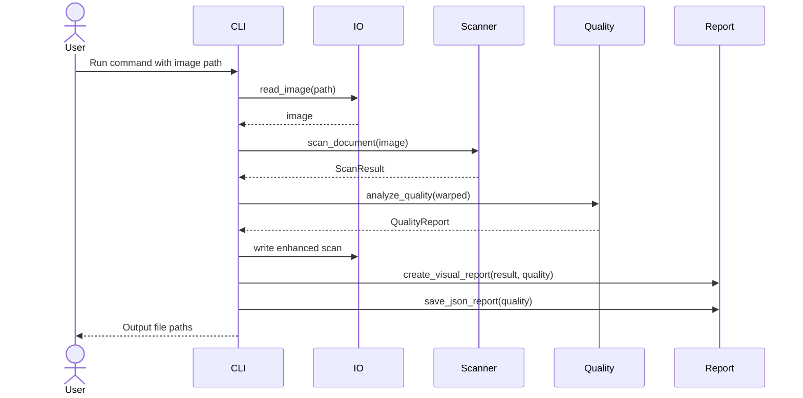

# Sequence Diagram

```mermaid
sequenceDiagram
    actor User
    participant CLI
    participant IO
    participant Scanner
    participant Quality
    participant Report

    User->>CLI: Run command with image path
    CLI->>IO: read_image(path)
    IO-->>CLI: image
    CLI->>Scanner: scan_document(image)
    Scanner-->>CLI: ScanResult
    CLI->>Quality: analyze_quality(warped)
    Quality-->>CLI: QualityReport
    CLI->>IO: write enhanced scan
    CLI->>Report: create_visual_report(result, quality)
    CLI->>Report: save_json_report(quality)
    CLI-->>User: Output file paths
```

