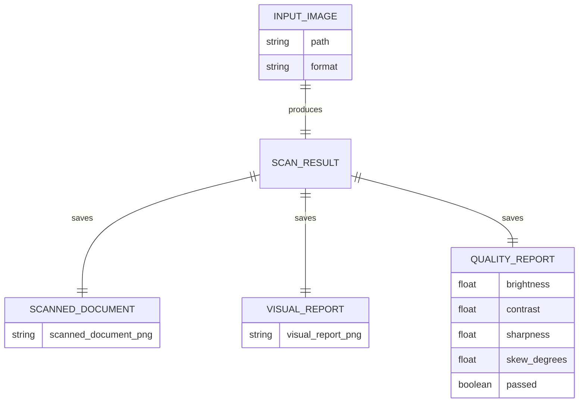

# Database / Storage Design

This project does not require a database because it processes a single image and writes file-based outputs. The storage design is file-oriented:

```mermaid
erDiagram
    INPUT_IMAGE ||--|| SCAN_RESULT : produces
    SCAN_RESULT ||--|| SCANNED_DOCUMENT : saves
    SCAN_RESULT ||--|| VISUAL_REPORT : saves
    SCAN_RESULT ||--|| QUALITY_REPORT : saves

    INPUT_IMAGE {
        string path
        string format
    }
    SCANNED_DOCUMENT {
        string scanned_document_png
    }
    VISUAL_REPORT {
        string visual_report_png
    }
    QUALITY_REPORT {
        float brightness
        float contrast
        float sharpness
        float skew_degrees
        boolean passed
    }
```

