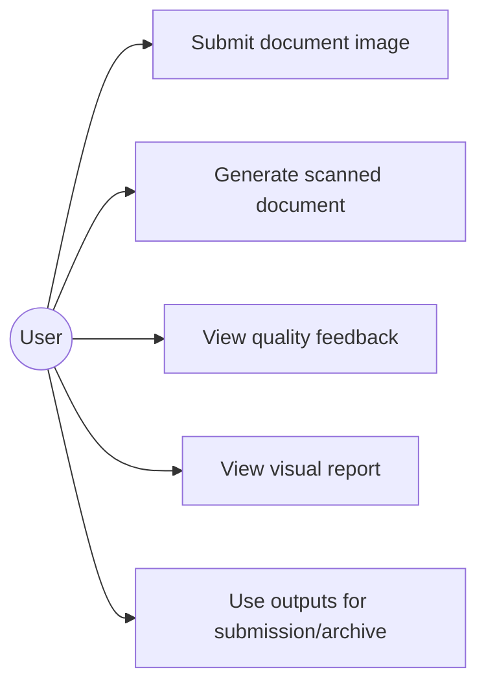

# Use Case Diagram

```mermaid
flowchart LR
    User((User))
    U1[Submit document image]
    U2[Generate scanned document]
    U3[View quality feedback]
    U4[View visual report]
    U5[Use outputs for submission/archive]

    User --> U1
    User --> U2
    User --> U3
    User --> U4
    User --> U5
```

