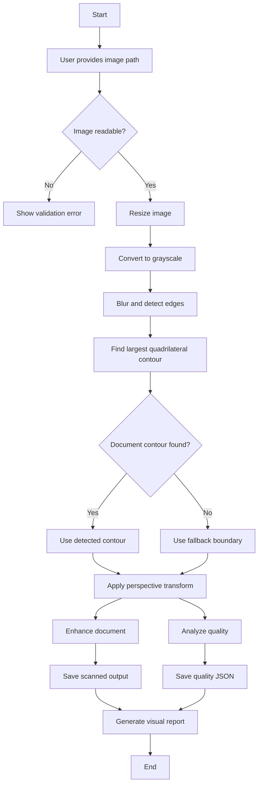

# Workflow Diagram

```mermaid
flowchart TD
    A[Start] --> B[User provides image path]
    B --> C{Image readable?}
    C -- No --> D[Show validation error]
    C -- Yes --> E[Resize image]
    E --> F[Convert to grayscale]
    F --> G[Blur and detect edges]
    G --> H[Find largest quadrilateral contour]
    H --> I{Document contour found?}
    I -- Yes --> J[Use detected contour]
    I -- No --> K[Use fallback boundary]
    J --> L[Apply perspective transform]
    K --> L
    L --> M[Enhance document]
    L --> N[Analyze quality]
    M --> O[Save scanned output]
    N --> P[Save quality JSON]
    O --> Q[Generate visual report]
    P --> Q
    Q --> R[End]
```

